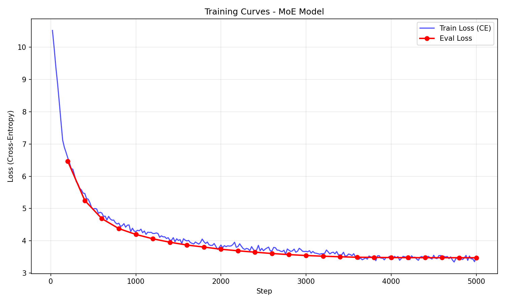
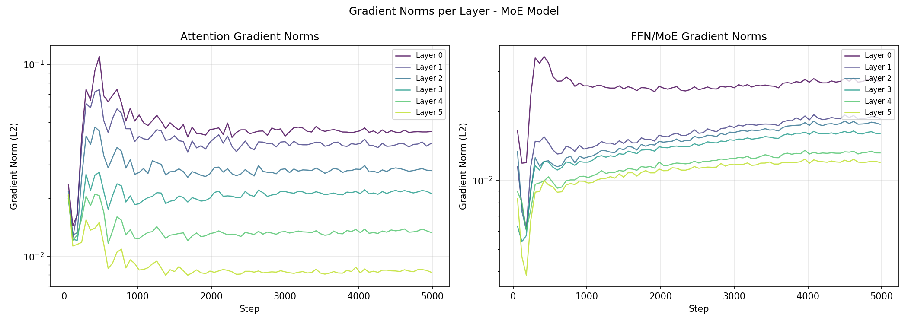
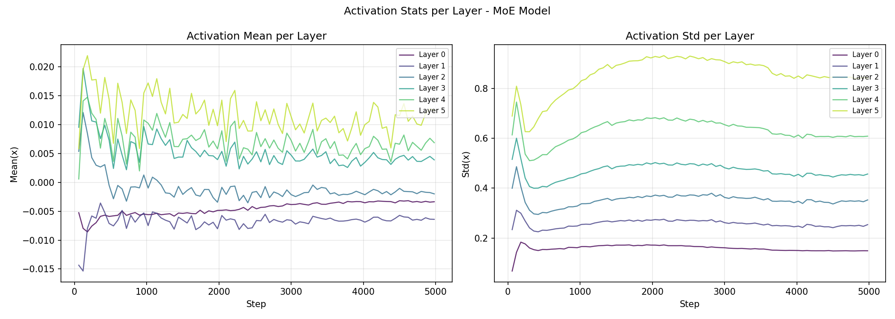
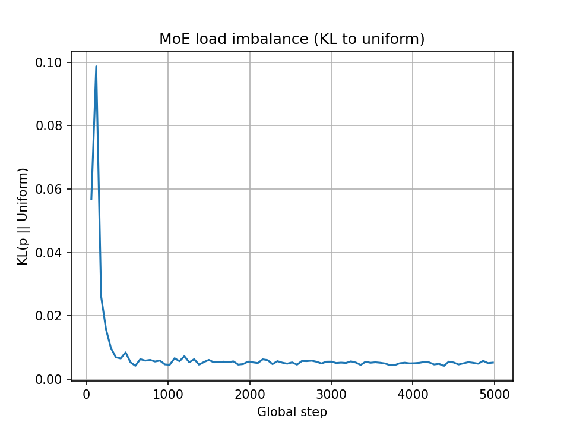

Ce repo contient une implémentation **compacte** et pédagogique d'un LLM suivant l'architecture de Qwen3

---

## Structure du repo

- `train.py` : entraînement (WikiText-103) + logs + plots
- `benchmark_sampling.py` : génération + benchmark latence (avec/sans KV-cache)
- `model.py` : modèle `DecoderOnlyLM` (MoE) + `DecoderOnlyLMDense` (baseline dense)
- `decoder.py` : bloc decoder (Pre-Norm RMSNorm + GQA + MoE/FFN)
- `gqa.py` : attention GQA + RoPE + **KV cache**
- `MoE.py` : MoE top-k (inspiré Switch/DeepSeek) + FFN SwiGLU
- `dataprep.py` : chargement/tokenization + création de blocks
- `configs/` : configs dataclass (train / sample / modèle)


Notes :
- `torch.compile` (utilisé dans `train.py`) nécessite **PyTorch ≥ 2.0**.
- Le training force du **bfloat16** dans `train.py` (voir section “Types & dtypes”). Sur GPU non compatible bf16, il faudra adapter.

---

## Installation, Train, Sample

### 1) Installer les dépendances

```bash
pip install -r requirements.txt
```

### 2) Créer le dossier `analytics/`

Les scripts sauvegardent des figures dans `analytics/`

```bash
mkdir -p analytics
```

### 3) Lancer un entraînement

Ouvrir/éditer la config : `configs/train_cfg.py` et `configs/model_cfg.py`
Points utiles : `use_moe`, `tie_embeddings`, `active_experts`, `total_experts`
⚠️ Par défaut, `save_model=False`


```bash
python train.py
```

Sorties :
- logs dans le terminal
- figures : avec la config actuelle on obtient un train plutot stable : 






---

### 4) Sampling

Vérifier la config : `configs/sample_cfg.py`

Points utiles : `use_kv_cache` (pour observer la différence de vitesse de sampling), `load_ckpt` (initialement à False)

```bash
python benchmark_sampling.py
```

Sorties :
- un exemple de génération dans le terminal
- un plot de latence dans `analytics/per_token_times.png`

---

Exemple de texte que l'on peut avoir en lançant train avec la config actuelle : 

```
Once upon a time after the storm , the storm accelerated northwestward and continued northeastward . The storm then turned to the southeast on October 21 , then north @-@ northeastward . Early on October 21 , the storm made landfall near Nantucket with winds of 60 mph ( 95 km / h ) . The next day , it degenerated into a remnant low the following day . 

 The storm dropped heavy rainfall along its path across the eastern Gulf of Mexico and caused moderate to severe flooding . A storm surge of up to 9 @.@ 6 feet ( 2 @.@ 0 m ) occurred in Sinaloa , which washed a river into the Gulf of Mexico and resulted in widespread power outages . 

 = = Meteorological history = = 

 A tropical disturbance was observed at 1500 UTC on November 8 , south of the Azores . Initially , the system was named <unk> on November 7 , but the JMA designated the system as Tropical Depression Six on November 8 while the system was still offshore . Shortly thereafter , the depression began developing a broad low pressure system while crossing southeastern Africa . On November 10 , the depression strengthened into Tropical Storm Eloise early the next day . 

 On December 11 , a trough , formed in the Caribbean Sea about 270 mi ( 849

```
